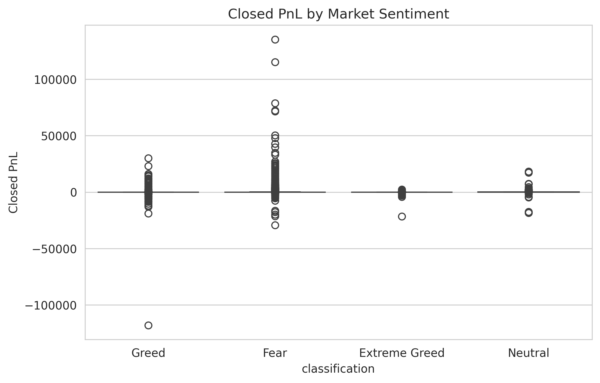
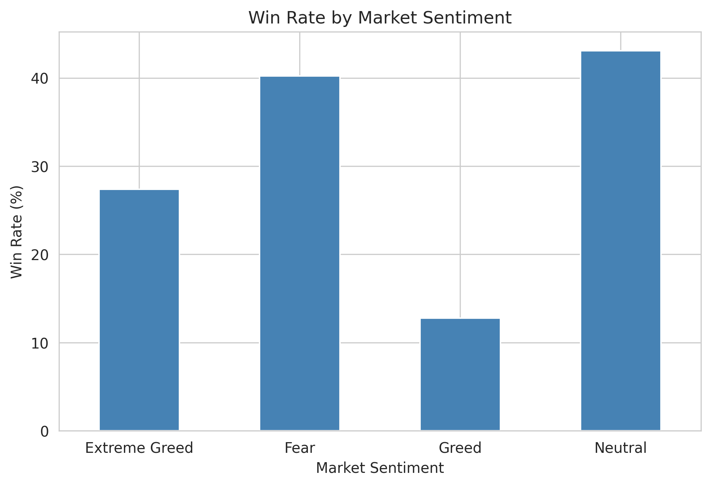
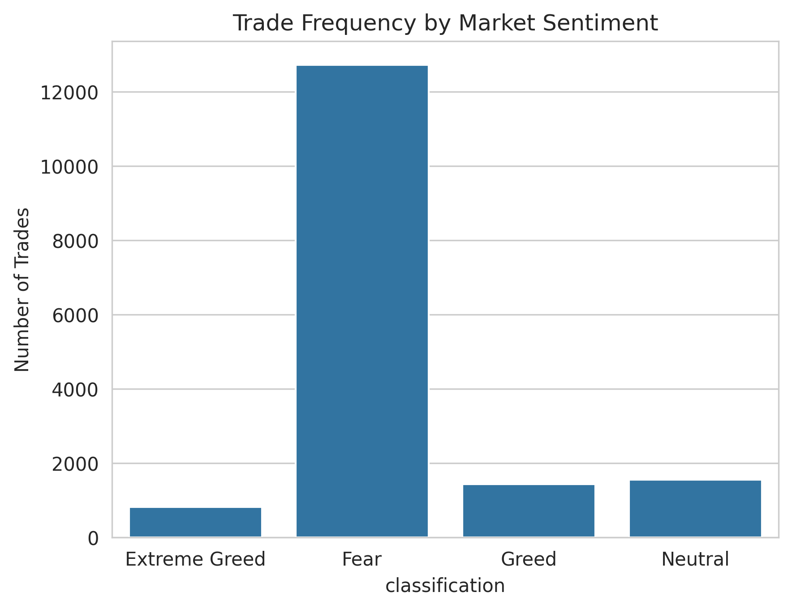
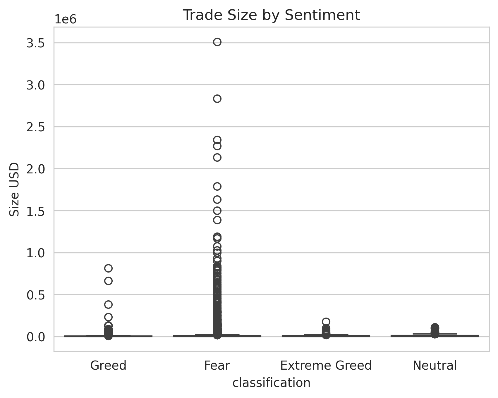
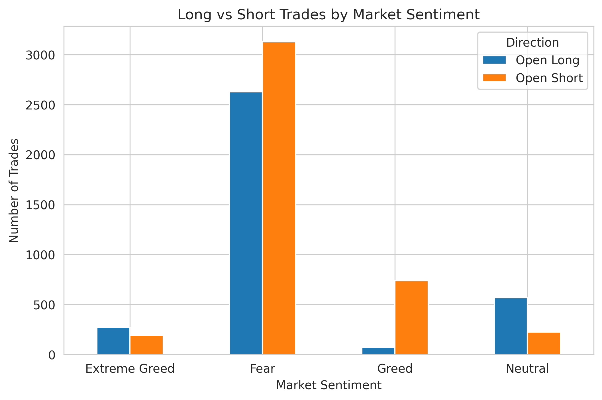
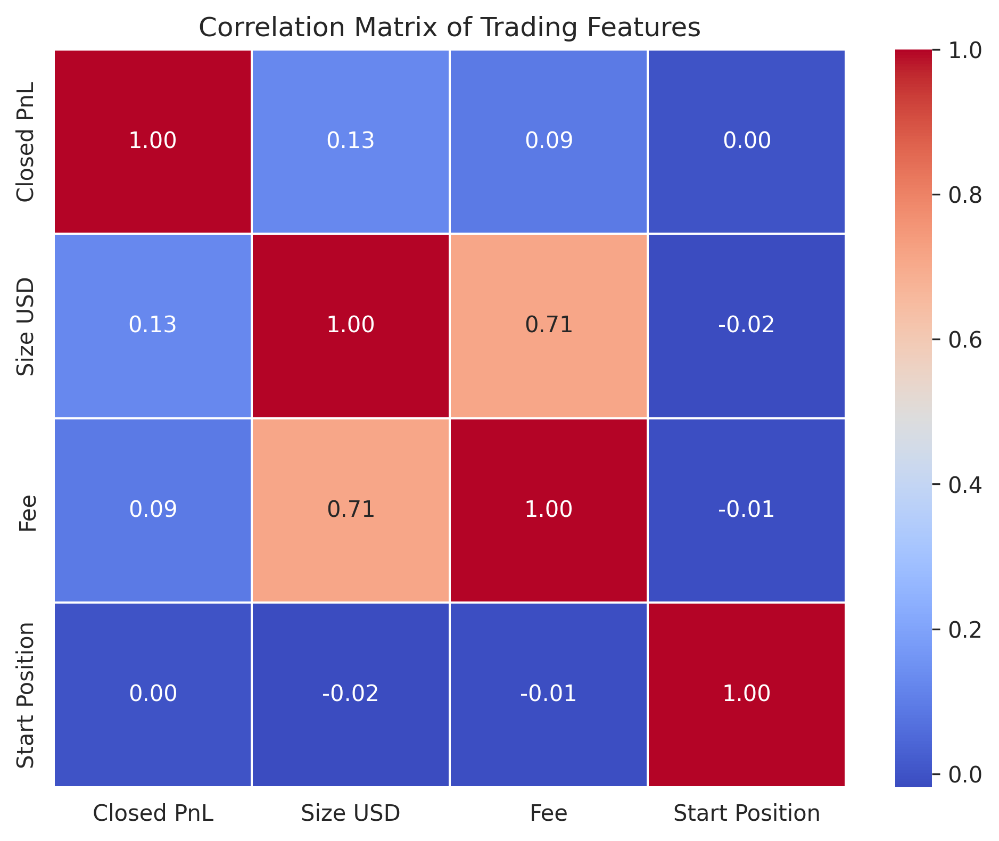
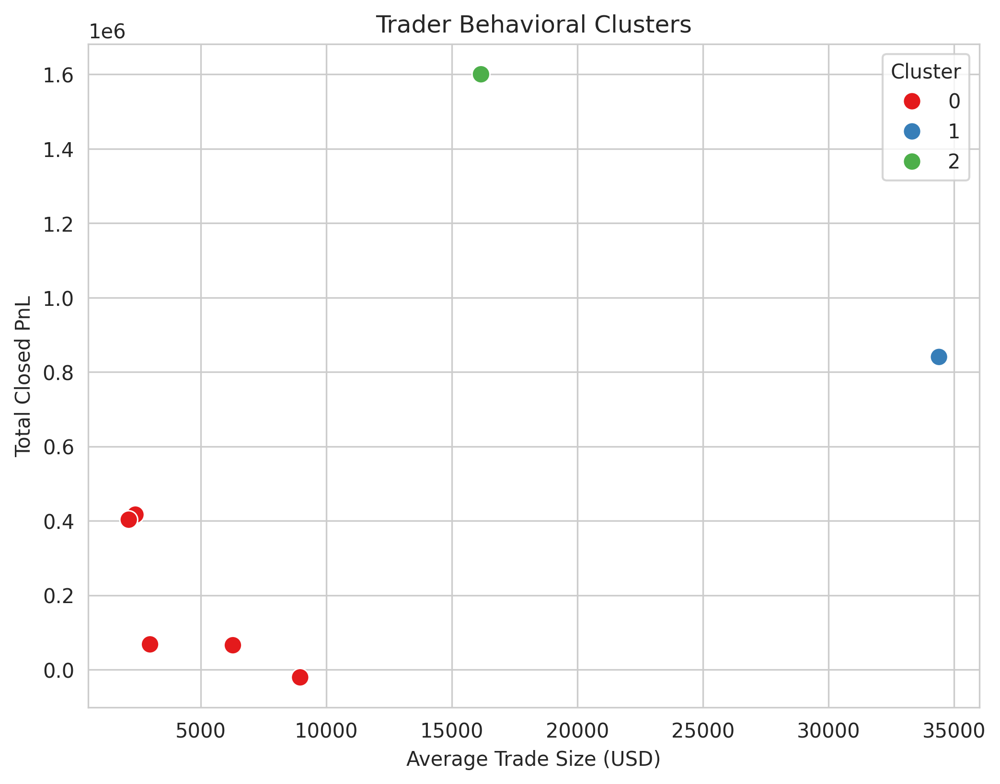

# Trader Performance vs Market Sentiment Analysis

## Overview

This project analyzes the relationship between **Bitcoin market sentiment (Fear & Greed Index)** and **Hyperliquid trader performance**. The objective is to understand how market sentiment influences trading behavior, profitability, and decision-making, and to derive actionable trading insights.

---

## Dataset

This project uses two datasets:

1. **Bitcoin Fear & Greed Index**
   - Date
   - Market Sentiment Classification (Fear, Greed, etc.)

2. **Hyperliquid Historical Trader Data**
   - Account
   - Coin
   - Execution Price
   - Trade Size
   - Direction
   - Closed PnL
   - Fees
   - Timestamp
   - Trade ID

> **Note:**
> 1) Bitcoin Market Sentiment (Fear/Greed)
Columns: Date, Classification (Fear / Greed)
Link: https://drive.google.com/file/d/1PgQC0tO8XN-wqkNyghWc_-mnrYv_nhSf/view?usp=sharing

> 2) Historical Trader Data (Hyperliquid)
Includes fields like: account, symbol, execution price, size, side, time, start position, event, closedPnL, leverage, etc.
Link: https://drive.google.com/file/d/1IAfLZwu6rJzyWKgBToqwSmmVYU6VbjVs/view?usp=sharing

---

# Methodology

## Part A – Data Preparation

- Loaded both datasets using Pandas.
- Inspected dataset dimensions, data types, missing values, and duplicates.
- Converted timestamps into datetime format.
- Aligned trader data with the Fear & Greed Index using the trading date.
- Created analytical features including:
  - Win indicator
  - Daily trade count
  - Trade size
  - Long vs Short positions
  - Trader frequency and trader size segments

---

## Part B – Exploratory Data Analysis

The following analyses were performed:

- Profitability (Closed PnL) by market sentiment
- Win Rate comparison
- Trade Frequency analysis
- Trade Size analysis
- Long vs Short position analysis
- Trader Segmentation
- Correlation Analysis

### Key Insights

- Traders achieved **higher average profitability** during Fear periods than Greed periods.
- **Win rates were significantly higher** during Fear periods.
- Traders showed a **Long bias during Fear** and a **Short bias during Greed**.
- Larger traders generally achieved **higher average win rates** than smaller traders.

---

## Part C – Strategy Recommendations

Based on the analysis:

- Use market sentiment as an additional **risk management indicator** when making trading decisions.
- Prioritize **trade quality and disciplined position sizing** over simply increasing trading frequency.

---

## Bonus

Implemented **K-Means Clustering** to group traders into behavioral segments based on:

- Trading Frequency
- Average Trade Size
- Total Closed PnL
- Win Rate

---

## Output Visualizations

### Closed PnL Analysis


### Win Rate Analysis


### Trade Frequency Analysis


### Trade Size Analysis


### Long vs Short Analysis


### Correlation Heatmap


### Trader Clustering


---

## Libraries Used

- pandas
- numpy
- matplotlib
- seaborn
- scikit-learn
- jupyter

---

## Installation

Clone the repository:

```bash
git clone https://github.com/divyanshi80405/trader-performance-vs-market-sentiment.git
```

Install dependencies:

```bash
pip install -r requirements.txt
```

---

## How to Run

1. Download the datasets from the assignment links.
2. Place the datasets in your local project directory (or update the file paths in the notebook if needed).
3. Open the notebook:

```bash
jupyter notebook Trader_Sentiment_Analysis.ipynb
```

4. Run all cells from top to bottom.

---

## Future Improvements

- Predictive modeling for trader profitability
- Interactive Streamlit dashboard
- Advanced behavioral clustering
- Time-series forecasting of trading performance
